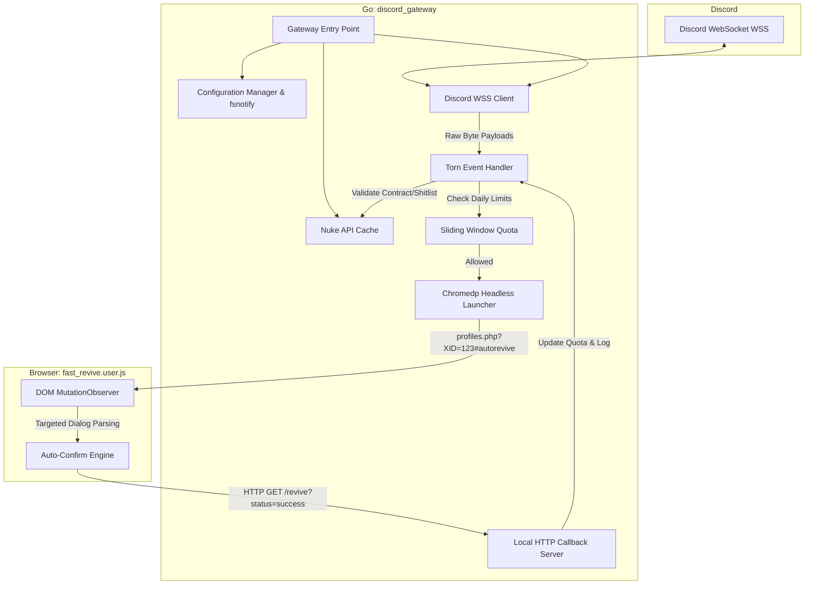

# Discord Gateway - Fast Revive Integration

[](https://go.dev/)
[](https://opensource.org/licenses/MIT)

A highly optimized, zero-allocation Discord Gateway client designed specifically to process Torn-related Webhook events (specifically Revive requests) with absolute minimal latency. It seamlessly integrates a Go backend with a local userscript to automate rapid responses to faction contracts.

## 🚀 Features

- **Zero-Allocation Parsing:** Utilizes direct byte-scanning signatures rather than expensive JSON reflection for sub-millisecond Discord payload processing.
- **Dynamic Configuration:** Live configuration reloading via `fsnotify`, enabling token and quota changes without restarting the application.
- **Nuke API Integration:** Periodically fetches and caches Faction Contracts, Player Packages, and Shitlists to enforce rule-based reviving.
- **E2E Mock Testing Suite:** Built-in simulated HTTP endpoints to rigorously test Chromedp behavior without spending real in-game energy.
- **Event-Driven Userscript:** A heavily optimized Tampermonkey script (`reviver.user.js`) that leverages browser `MutationObserver` hooks to instantly confirm revive dialogs.

## 🏗️ Architecture

This project strictly adheres to the Single Responsibility Principle, modularized into distinct, decoupled components.



### The Hot Path
When a `MESSAGE_CREATE` event is pushed over the websocket, the payload is routed directly to the `torn.Handler`. Rather than unmarshaling the entire JSON payload using standard library reflection, the hot path performs direct byte-scanning (`bytes.Contains` and `bytes.Index`) against pre-computed signatures.

If the payload is valid and passes Nuke API contract verification, the system instructs `chromedp` to launch a headless browser pointing directly to the target's profile.

### The Userscript Execution
The local Tampermonkey script (`reviver.user.js`) detects the `#autorevive` URL hash and immediately scopes a `MutationObserver` directly to the `#profileroot`. It waits exactly for the confirmation dialog, bypasses all global `document.body` scanning overhead, verifies the % chance, and auto-clicks "Yes". Finally, it pings the local Go Callback Server to track the success.

## 🛠️ Prerequisites

- **Go 1.22+** installed on your system.
- A local browser installation (e.g., Google Chrome or Chromium) for Chromedp.
- A Discord Bot Token with message content intents.
- A Tampermonkey extension with `reviver.user.js` installed.

## ⚙️ Setup & Configuration

The application relies on a user-specific `.env` file located in `~/.config/discord_gateway/.env`. 

Example `.env` structure:
```env
DISCORD_TOKEN=your_bot_token_here
TARGET_CHANNELS=1234567890,0987654321
NUKE_API_TOKEN=your_nuke_api_token
DAILY_QUOTA=150
MIN_AGE_DAYS=14
IGNORE_FACTION_SHITLIST=true
```

## 🚀 Execution

```bash
# Build the applications
go build ./cmd/gateway
go build ./cmd/mock_torn

# Run the primary gateway client
./gateway
```

### Testing (E2E)
You can run the end-to-end test suite which stands up the `mock_torn` server and fires payload bytes directly into the pipeline:
```bash
go test ./internal/e2e -v
```

## 🤝 Contributing

Contributions are welcome! Please ensure that all code remains zero-allocation on the hot path and passes the existing benchmark suite. Open an issue or submit a Pull Request to discuss proposed changes.

## 📄 License

This project is licensed under the MIT License.
