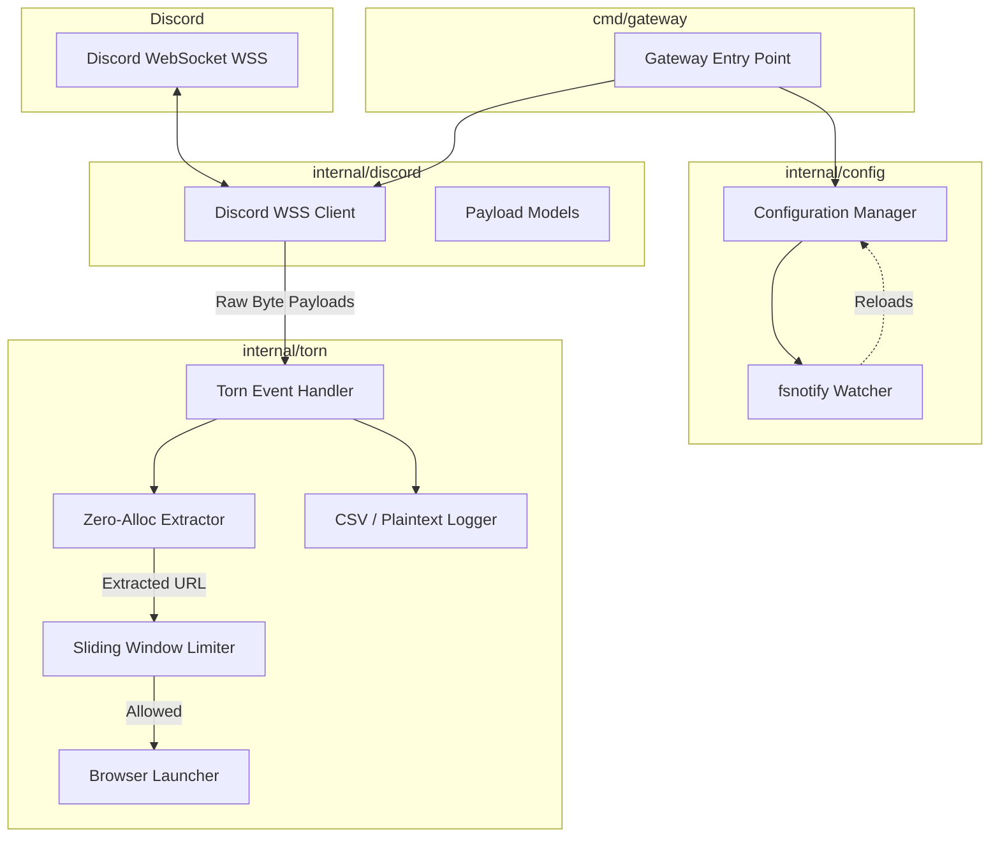

# Discord Gateway - Torn Integration

[](https://go.dev/)
[](https://opensource.org/licenses/MIT)

A highly optimized, zero-allocation Discord Gateway client designed specifically to process Torn-related Webhook events with absolute minimal latency.

## 🚀 Features

- **Zero-Allocation Parsing:** Utilizes direct byte-scanning signatures rather than expensive JSON reflection for sub-millisecond payload processing.
- **Dynamic Configuration:** Live configuration reloading via `fsnotify`, enabling token and channel changes without restarting the application.
- **Robust Rate Limiting:** A sliding-window, mutex-backed rate limiter protects the host OS from being overwhelmed by child process spawns (`xdg-open`).
- **Concurrent Logging:** Supports simultaneous plaintext debugging and CSV record keeping for analytics.

## 🏗️ Architecture

This project strictly adheres to the Single Responsibility Principle, modularized into distinct, decoupled components. 



### The Hot Path
When a `MESSAGE_CREATE` event is pushed over the websocket, the payload is routed directly to the `torn.Handler`. Rather than unmarshaling the entire JSON payload using standard library reflection, the hot path (`internal/torn/extractor.go`) performs direct byte-scanning (`bytes.Contains` and `bytes.Index`) against pre-computed byte signatures. 

This technique allows the application to detect the target channel, identify the target country, and extract the required URL with zero heap allocations, avoiding garbage collection pauses entirely.

## 🛠️ Prerequisites

- **Go 1.22+** installed on your system.
- A Linux-based OS (utilizes `xdg-open` for browser launching).
- A Discord Bot Token with the necessary intents.

## ⚙️ Setup & Configuration

The application relies on a user-specific `.env` file located in `/opt/discord_gateway/$USER/.env`. 

Example `.env` structure:
```env
DISCORD_TOKEN=your_bot_token_here
TARGET_CHANNELS=1234567890,0987654321
TARGET_COUNTRIES=Switzerland,Japan,Argentina
```

## 🚀 Execution

```bash
# Build the applications
go build ./cmd/gateway
go build ./cmd/inspector

# Run the primary gateway client
./gateway

# Run the inspector (for debugging raw JSON payloads)
./inspector
```

## 🤝 Contributing

Contributions are welcome! Please ensure that all code remains zero-allocation on the hot path and passes the existing benchmark suite. Open an issue or submit a Pull Request to discuss proposed changes.

## 📄 License

This project is licensed under the MIT License.
